# Credit Risk Decision Engine

A production-shaped AI/ML portfolio project that converts a new credit application into a calibrated probability of payment difficulty, risk band, approve/manual-review/reject recommendation, illustrative expected loss, and optional applicant-level reason codes.

> Educational prototype only. This repository is not a lending policy, credit bureau, adverse-action system, or production underwriting service.

## Business problem

Credit decisions need more than a binary classifier. A useful risk system must estimate probability quality, expose its decision-policy assumptions, preserve a human-review path, and prevent training-serving mismatch. This project demonstrates that workflow using the Kaggle Home Credit `application_train.csv` dataset without requiring raw data in Git.

`TARGET = 1` means observed payment difficulty in the source dataset. It is a historical modelling proxy, not a universal definition of default.

## System architecture

```mermaid
flowchart LR
    A["application_train.csv (local only)"] --> B["Schema and quality validation"]
    B --> C["Deployable feature contract selection"]
    C --> D["Model / policy / final-test split"]
    D --> E["Fold-fitted preprocessing and candidate comparison"]
    E --> F["Selected model and probability calibration"]
    F --> G["Policy-holdout threshold optimization"]
    G --> H["Untouched final-test evaluation"]
    H --> I["Versioned artifacts and feature metadata"]
    I --> J["Artifact-only prediction pipeline"]
    J --> K["FastAPI"]
    J --> L["Streamlit"]
```



The 307,511 rows first reserve 61,503 untouched final-test rows. The remaining development data is split into 196,806 model-selection/calibration rows and 49,202 policy-selection rows. Logistic Regression, XGBoost, and LightGBM use identical stratified folds and fold-fitted preprocessing. Sigmoid and isotonic calibration are compared on the policy holdout, policy thresholds are then selected there, and the final test is opened only after model, calibration, and policy choices are fixed.

## Training vs deployment feature availability

Home Credit contains strong anonymized `EXT_SOURCE_1`, `EXT_SOURCE_2`, and `EXT_SOURCE_3` features. Their generation mechanism is unavailable, so a completely new applicant cannot supply them. Their historical EDA and full-feature benchmark remain useful, but the deployable model excludes them and every engineered aggregate derived from them.

The deployable model intentionally sacrifices any performance associated with unavailable features so that every production feature can be reproduced for a new applicant.

The same rule excludes bureau inquiries, building records, social-circle history, document/contact telemetry, administrative history, and regional attributes whose upstream source is not implemented. Gender, family status, education, and occupation are excluded from the recommended contract because of sensitive/proxy concerns and the absence of a jurisdiction-specific necessity and fairness review. The complete audit is in [`docs/feature_availability_audit.md`](docs/feature_availability_audit.md).

## Deployable feature contract

`src/components/feature_contract.py` is the shared source of truth for training, validation, Streamlit, FastAPI, inference, and explanation labels. It defines field source, requirement status, type, category vocabulary, UI range, help text, and internal transformation.

Applicant-provided deployable fields:

- age and employment duration;
- family members and number of children;
- annual income, requested credit, repayment obligation, and goods/asset price;
- credit product type, income type, and housing situation;
- declared car and property ownership.

System-derived deployable fields:

- age and cleaned employment years, employment anomaly, and employment-to-age ratio;
- loan/income, repayment/income, loan/repayment, and loan/goods-price ratios;
- income, loan, and repayment per household member;
- children-to-household ratio.

Feature engineering is non-mutating, target-independent, zero-safe, and shared by training and inference. Arbitrary unused dataset columns cannot silently enter production training.

## Record IDs vs application IDs

`SK_ID_CURR` identifies a historical Home Credit row. It is retained only for research or returned as `source_record_id` during historical CSV scoring. It is never a predictor and is not required from a new applicant.

Every scoring request receives a server-generated traceability identifier such as `APP-7C91E28A4F`. `application_id` is created with a UUID-derived random suffix after input normalization, returned by FastAPI and Streamlit, and never passed to feature engineering, preprocessing, calibration, or the model.

## Measured model results

All figures below were produced on the complete local dataset on 10 August 2026. They are stored in ignored artifact JSON files; no metric was inferred or fabricated.

### Research full-feature benchmark

The preserved historical benchmark used the broad Home Credit application table, including anonymized external scores.

| Metric | Full-feature benchmark |
|---|---:|
| Selected model | XGBoost |
| Calibrated final-test ROC-AUC | 0.7687 |
| Calibrated final-test PR-AUC | 0.2605 |
| Calibrated final-test Brier score | 0.06701 |
| Top 10% risk default capture | 35.23% |
| Calibration | Isotonic |
| Approve / reject thresholds | 0.12 / 0.13 |

### Deployable application model

Development-only out-of-fold comparison on the 196,806-row model partition:

| Candidate | ROC-AUC | PR-AUC | Brier score |
|---|---:|---:|---:|
| XGBoost | 0.6840 | 0.1636 | 0.07146 |
| LightGBM | 0.6803 | 0.1602 | 0.07165 |
| Logistic Regression | 0.6401 | 0.1323 | 0.07278 |

XGBoost was selected dynamically from these measurements. Final deployable results on the untouched 61,503-row test:

| Metric | Deployable result |
|---|---:|
| Calibrated ROC-AUC | 0.6920 |
| Calibrated PR-AUC | 0.1686 |
| Calibrated Brier score | 0.07121 |
| Top 10% risk default capture | 26.08% |
| Selected calibration | Isotonic |
| Measured approve / reject thresholds | 0.11 / 0.12 |
| Approval / review / rejection | 78.78% / 3.29% / 17.92% |
| Approved observed payment-difficulty rate | 5.70% |

Removing unavailable features reduced final-test ROC-AUC by 0.0766 and PR-AUC by 0.0918, while Brier score increased by 0.00420. This is the expected cost of removing a major source of historical signal and eliminates the more serious failure of pretending those values exist for new applicants.

Isotonic calibration won policy-holdout Brier score. On the final test its Brier score was slightly worse than the uncalibrated model (0.071207 versus 0.071200), while ranking improved slightly. That limitation is reported rather than hidden.

## Risk policy and expected loss

Calibrated probability is converted to `LOW`, `MODERATE`, `HIGH`, or `VERY_HIGH` risk and to `APPROVE`, `MANUAL_REVIEW`, or `REJECT`. Threshold candidates are constrained by illustrative approval, review-capacity, and approved-risk limits on the policy holdout.

```text
Expected Loss = PD × LGD × EAD
```

The 60% LGD, 8% net margin, and requested credit as EAD are transparent illustrative assumptions—not portfolio facts. Monetary results are labelled in neutral dataset currency units.

## Explainability

For the selected XGBoost model, inference returns local native TreeSHAP contributions using friendly contract labels. External-score features, `SK_ID_CURR`, and `application_id` cannot appear because none enter the deployable feature matrix. Contributions describe model influence, not causation or legally sufficient adverse-action reasons.

## Project structure

```text
.
├── api.py                         # Explicit new-applicant FastAPI schema
├── app.py                         # Guided Streamlit application
├── docs/feature_availability_audit.md
├── notebooks/                     # Five research-to-deployment notebooks
├── scripts/refine_notebooks.py    # Reproducible notebook source builder
├── src/
│   ├── config.py
│   ├── components/
│   │   ├── feature_contract.py    # Production feature and UI contract
│   │   ├── feature_engineering.py # Deployable and benchmark transformations
│   │   └── ...
│   ├── pipeline/                  # Training and artifact-only prediction
│   └── utils/artifacts.py
├── tests/                         # Synthetic deterministic tests
├── .github/workflows/ci.yml
└── pyproject.toml
```

Raw/processed data, trained artifacts, logs, environments, and caches are ignored. The raw dataset is not modified by training or prediction.

## Installation

Python 3.11 is the supported runtime.

```bash
python -m venv .venv
# Windows: .venv\Scripts\activate
# macOS/Linux: source .venv/bin/activate
python -m pip install --upgrade pip
python -m pip install -r requirements-dev.txt
python -m pip install -e .
```

Place a separately obtained `application_train.csv` at `data/raw/application_train.csv`.

## Train and predict

```bash
python -m src.pipeline.training_pipeline --data-path data/raw/application_train.csv
credit-risk-predict --input applicant.json --explain
credit-risk-predict --input applicants.csv
```

Training persists the preprocessor, explanation model, calibrated prediction model, metrics, feature contract, complete feature-availability audit, split details, selected calibration, and policy. Prediction never retrains.

## FastAPI

```bash
uvicorn api:app --host 0.0.0.0 --port 8000
```

New-application request—no dataset ID or external score is accepted:

```json
{
  "age": 34,
  "years_employed": 5,
  "family_members": 2,
  "number_of_children": 0,
  "annual_income": 202500,
  "requested_loan_amount": 406597.5,
  "loan_annuity": 24700.5,
  "goods_purchase_price": 351000,
  "credit_product_type": "Cash loans",
  "income_type": "Working",
  "housing_situation": "House / apartment",
  "owns_car": false,
  "owns_property": true,
  "include_explanation": true
}
```

The response includes `application_id`, calibrated probability, risk band, recommendation, expected loss, and optional risk drivers. Normal errors do not expose stack traces.

## Streamlit

```bash
streamlit run app.py
```

The default guided form uses native numeric inputs, categorical select boxes, and contract-sourced help icons. It generates the application ID on submission and never asks for `SK_ID_CURR` or external scores. Advanced JSON and CSV scoring remain available; historical IDs are output only as `source_record_id`.

## Tests and CI

```bash
python -m compileall app.py api.py src tests
python -m pytest -q
python -m pip check
```

Tests use synthetic data and temporary artifacts. They require no external services, secrets, raw dataset, or pre-existing user model.

## Limitations, ethics, and fairness

- The model uses one historical competition table and is not representative of every population, product, geography, or economic period.
- `TARGET` is a proxy outcome; historical labels, missingness, and prior decisions can encode bias.
- Even the reduced contract contains potential socioeconomic proxies and has not passed a jurisdiction-specific legal or fairness review.
- No reject inference, causal analysis, temporal validation, drift study, stress test, independent validation, or production security assessment is claimed.
- Explanations are associational, not causal or guaranteed to satisfy adverse-action requirements.
- Real use requires data minimization, access controls, subgroup performance/calibration review, monitoring, human oversight, appeal processes, and legal/regulatory approval.

## Future improvements

- Add point-in-time, documented upstream integrations only when their inference availability is guaranteed.
- Add temporal/out-of-time validation and repeated calibration assessment.
- Add fairness metrics, subgroup calibration, drift monitors, and a formal model card.
- Tune candidates inside nested validation and validate policy assumptions with real portfolio economics.
- Version data/model artifacts in a registry and add container/deployment manifests.
